<table border="0" cellspacing="0" cellpadding="0">
<tr>
<td>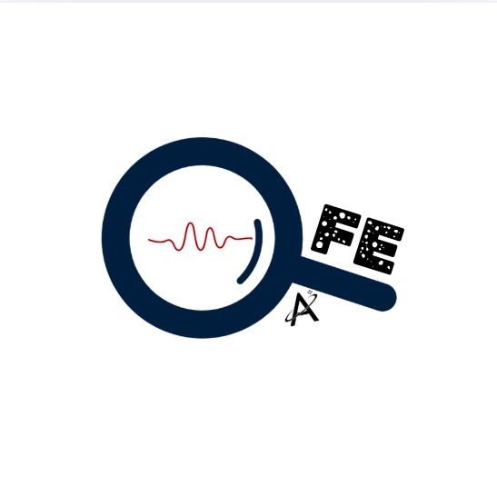</td>
<td><h1>&nbsp;Faraday Explorer</h1></td>
</tr>
</table>

An interactive desktop application for exploring radio-polarisation models and
real Faraday Dispersion Function (FDF) data side-by-side. The tool lets a
researcher draw an aperture anywhere on a peak-FDF map, extract its averaged
spectrum from FITS image cubes, and compare the result in real time against any
of the ten RM-Tools polarisation models (m1 – m111) with sliders for every
parameter.

Faraday Explorer is designed for typical MeerKAT / VLA polarisation cubes but
works with any FITS data that follows standard WCS conventions.

---

## Contents

1. [Installation](#installation)
2. [Quick Start](#quick-start)
3. [The Launch Workflow](#the-launch-workflow)
4. [Interface Guide](#interface-guide)
5. [Beam Handling](#beam-handling)
6. [File Formats](#file-formats)
7. [Model Reference](#model-reference)
8. [Testing](#testing)
9. [Performance and Known Limitations](#performance-and-known-limitations)
10. [Troubleshooting](#troubleshooting)
11. [How to Cite](#how-to-cite)
12. [Licence](#licence)

---

## Installation

### Prerequisites

- [Anaconda](https://www.anaconda.com/) or [Miniconda](https://docs.conda.io/en/latest/miniconda.html) — the installer searches the usual locations (`~/anaconda3`, `~/miniconda3`, `~/miniforge3`, etc.)
- A Linux desktop environment with `~/.local/share/applications` for the menu entry. macOS / Windows users can still run the script from the terminal.

`ffmpeg` is bundled automatically by the conda environment — no separate
install is required.

### Steps

```bash
git clone https://github.com/NJRSAM003/FaradayExplorer.git
cd FaradayExplorer
bash install.sh
```

`install.sh` will create (or update) a conda environment named `faraday_explorer` from `environment.yml` (numpy, scipy, matplotlib, astropy, PyQt5, ffmpeg) and writes a desktop entry to `~/.local/share/applications/` so *Faraday Explorer* appears in your application menu. It also marks the launcher script as executable for terminal usage.

You can also specify the environment name if need be: 

```bash
bash install.sh my_env_name
```

### Uninstalling

To fully remove Faraday Explorer from your system, run:

```bash
bash uninstall.sh
```
or if you custom named the environment:

```bash
bash uninstall.sh my_env_name
```

The uninstaller is interactive (asks for confirmation) and reverses every step the installer made.

After it's done, you can delete the cloned repository folder.

## Quick Start

### **Recommended: open the app from your application menu**
> After running `install.sh`, **search for *Faraday Explorer*** in your
> desktop's application launcher (the same menu where you find Firefox, your
> file manager, etc.) and **click the icon**. That's it — the app handles
> everything else (splash, conda environment activation, file picker).
> You can also **double-click a `Faraday Explorer` shortcut on your desktop**
> if you've created one.

**Alternative — terminal launch** (useful for debugging or remote work):

```bash
./launch_faraday_explorer.sh
```

On startup the animated splash screen plays:

<p align="center">
  
</p>

followed by the file-picker dialog.

**Command-line launch** (skip the splash and dialog):

```bash
# FDF-only mode
conda run -n faraday_explorer python3 faraday_explorer.py FDF.fits freqFile.dat

# Full mode (FDF + Stokes I, Q, U)
conda run -n faraday_explorer python3 faraday_explorer.py FDF.fits I.fits Q.fits U.fits freqFile.dat
```

### Trying it without your own data

The repo **ships with a small set of demo cubes under `dummy_cubes/`** — an
80 × 80 pixel (2 arcmin × 2 arcmin) cutout from a real MeerKAT L-band
observation of NGC 1097, centred at RA = 02:46:20.5  Dec = −29:35:00.5.

The cubes preserve **every metadata feature** of the original data:

- The Stokes I/Q/U cubes carry the original CASA per-channel **BEAMS**
  binary-table extension (9 rows; BMAJ range 6.7" – 12.1"), so launching the
  demo triggers the *"CASA Per-Channel Beam Tables Found"* popup
- WCS keywords (`CRVAL`, `CDELT`, `CRPIX`, `CTYPE` = `RA---SIN`/`DEC--SIN`)
  are correctly updated for the cropped region, so the WCS axis toggle and
  on-screen sky-coordinate readout work immediately
- The Faraday-depth axis of `FDF_demo.fits` is untouched (95 φ-slices)

| File | Content |
|---|---|
| `dummy_cubes/FDF_demo.fits` | Faraday Dispersion Function cube (95 φ-channels) |
| `dummy_cubes/Stokes_I_demo.fits` | Stokes I cube (9 freq. channels + BEAMS) |
| `dummy_cubes/Stokes_Q_demo.fits` | Stokes Q cube (9 freq. channels + BEAMS) |
| `dummy_cubes/Stokes_U_demo.fits` | Stokes U cube (9 freq. channels + BEAMS) |
| `dummy_cubes/freqFile_demo.dat` | The nine SPW centre frequencies in Hz |

Total size: ≈ 3.6 MB.

To launch the viewer on the demo data:

```bash
./launch_faraday_explorer.sh \
   dummy_cubes/FDF_demo.fits \
   dummy_cubes/Stokes_I_demo.fits \
   dummy_cubes/Stokes_Q_demo.fits \
   dummy_cubes/Stokes_U_demo.fits \
   dummy_cubes/freqFile_demo.dat
```

Or just start the app with no arguments and browse to those files in the
launch dialog.

---

## The Launch Workflow

When started without command-line arguments, Faraday Explorer guides the user
through four pre-flight checks before the main viewer opens.

### Step 1 — File selection

<p align="center">
  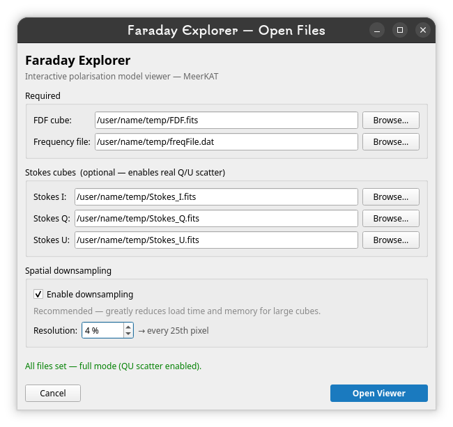
</p>

A dialog appears asking for:

- **Required:** the FDF cube and a frequency list file
- **Optional:** Stokes I, Q, U cubes (all three or none — used for q = Q/I and
  u = U/I scatter overlays)

All paths are remembered between sessions via `QSettings`, so re-opening the
dialog pre-fills the previous selection.

### Step 2 — Spatial downsampling

A toggle near the bottom of the dialog controls whether the spatial cube
dimensions are subsampled when computing the peak map and aperture sums:

- **ON** (recommended): the user types a percentage (e.g. 4 %) and a live
  label shows the resulting stride (e.g. *every 25th pixel*). This is essential
  for cubes ≥ 4096 × 4096 — without it, peak-map computation can take many GB
  of RAM.
- **OFF**: full-resolution extraction. Use only for small images or when
  precise photometry is required.

### Step 3 — Dimension and beam validation

Once the user clicks **Open Viewer**, Faraday Explorer verifies the inputs
before launching the main window:

1. **Spatial-dimension check.** All cubes must share the same RA × Dec pixel
   grid. If any differ, a critical error dialog lists the offending shapes and
   returns the user to the file picker.
2. **Beam validation.** Beam information (BMAJ / BMIN / BPA) is collected from
   each cube. See the dedicated [Beam Handling](#beam-handling) section below
   for the full decision tree.

### Step 4 — Resolution-assumption confirmation

For Stokes cubes **without** per-channel beam tables, a final confirmation
popup reminds the user that all frequency slices are assumed to share the
same angular resolution:

<p align="center">
  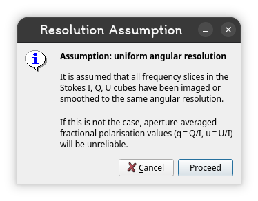
</p>

The user must click **Proceed** to continue. When CASA per-channel beam tables
are detected, this popup is skipped (since per-slice resolution is already
encoded).

---

## Interface Guide

<p align="center">
  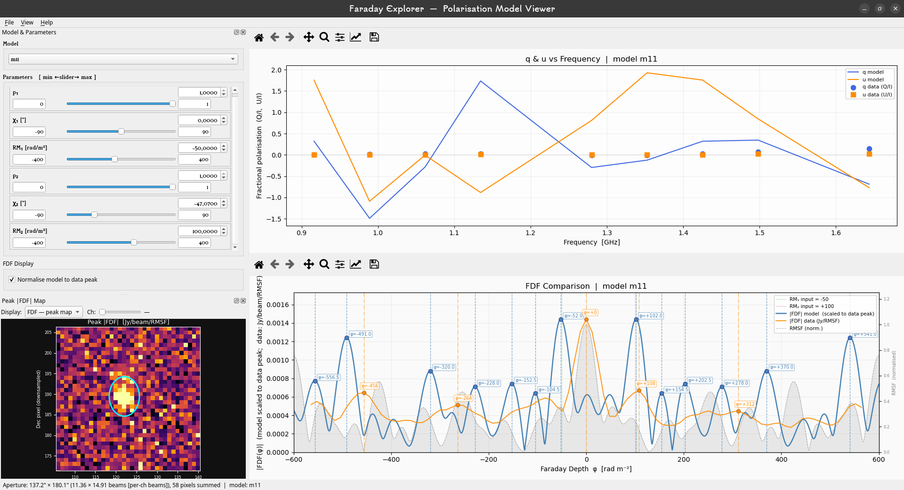
</p>

The main window is divided into two columns:

- **Left** — Model & Parameters (top, dockable) + Peak FDF Map (bottom,
  dockable). Both can be torn off and floated as independent windows.
- **Right** — Science plots: q & u vs Frequency (top), FDF Comparison (bottom).
  The two plots are vertically resizable via the central splitter.

The **View** menu lets you reopen any panel that was closed by accident, and
**View → Restore default layout** snaps everything back to its starting
positions and sizes.

### Map panel

<p align="center">
  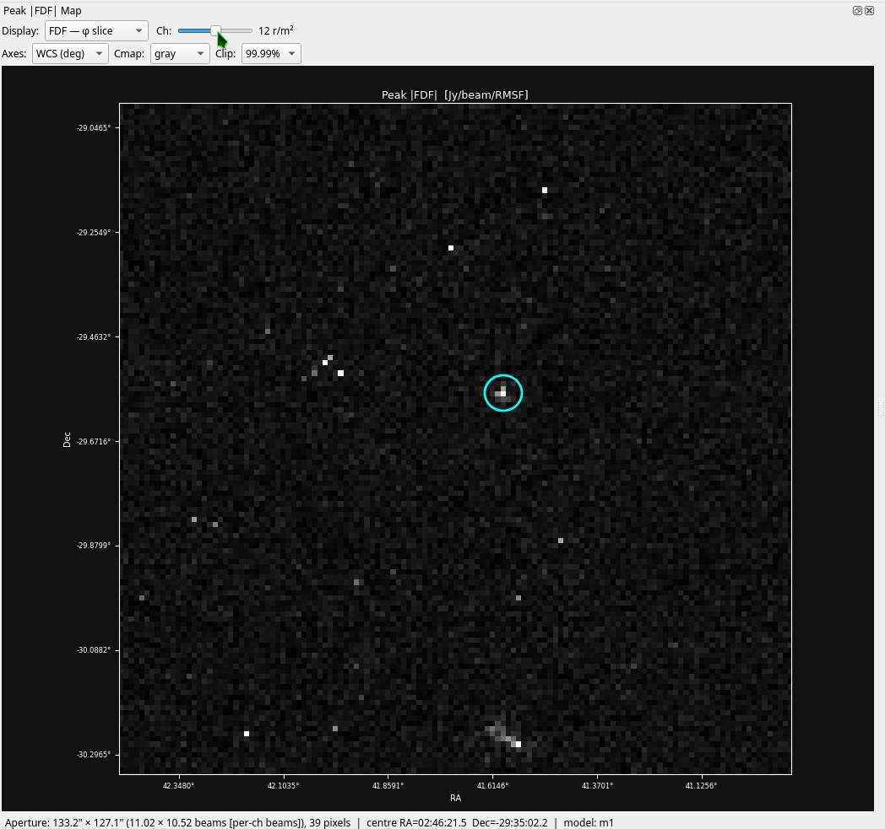
</p>

The map panel contains a navigation row at the top and a 2D image below.

#### Cube selector

<p align="center">
  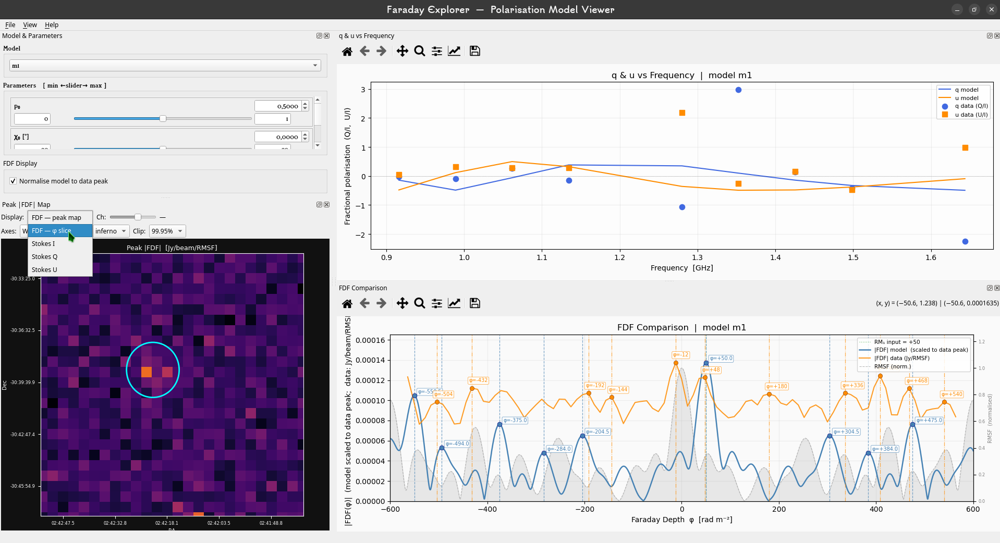
</p>

The **Display:** dropdown switches between five views:

- **FDF — peak map** *(default)*: the maximum `|FDF(φ)|` across all Faraday
  depth slices, computed once at startup
- **FDF — φ slice**: a single Faraday-depth slice — the channel slider
  selects φ (in rad/m²)
- **Stokes I / Q / U**: a single frequency channel — the channel slider
  selects ν (in GHz)

The channel slider is disabled for the peak-map view. The current channel
value is displayed to the right of the slider.

#### Map interactions

| Action | Effect |
|---|---|
| Left-click + drag | Pan |
| Scroll wheel | Zoom toward cursor |
| Middle-click | Centre the view on the click point |
| Double-click | Place the aperture centre (cyan `+` marker) |
| Double-click + hold + drag | Place centre and draw the ellipse in one motion |
| Double-click → release → click + drag | Two-step alternative |
| Double-click on an existing aperture | Clear it |

This information is also available at any time via the **Help → Map controls**
menu:

<p align="center">
  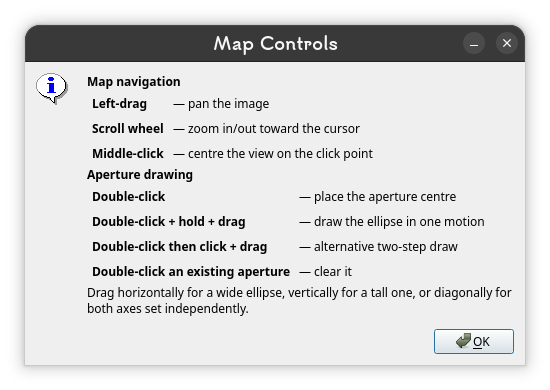
</p>

#### Elliptical aperture

The aperture is an ellipse aligned with the image axes. The drag distance from
the centre sets the semi-major axis along x and the semi-minor axis along y:

- Drag horizontally → wide, flat ellipse
- Drag vertically → tall, narrow ellipse
- Drag diagonally → both axes set independently

When the aperture is committed, its semi-axes are reported in arcseconds and
as a fraction of the beam FWHM (e.g. *2.4" × 1.8" (0.20 × 0.15 beams)*) when
beam information is available. The label `[per-ch beams]` appears when CASA
per-channel beams are used.

### Model & Parameters

<p align="center">
  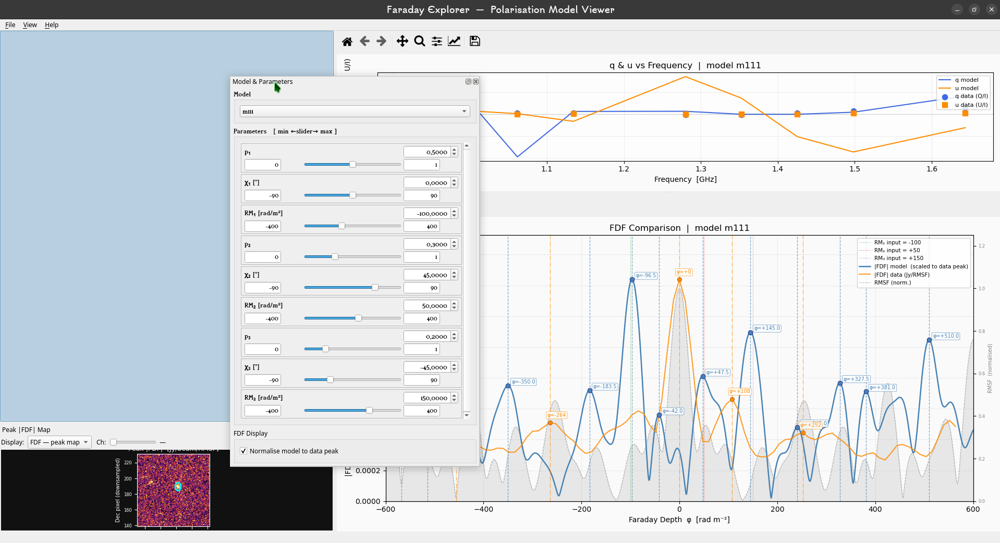
</p>

The model dropdown selects one of ten RM-Tools polarisation models (see the
[Model Reference](#model-reference)). Each parameter has its own widget with:

- **Spinbox** — precise value entry (type a number and press Enter)
- **Slider** — coarse-grained sweep, debounced at 40 ms
- **Min / Max fields** — editable bounds; press Enter to rescale the slider

Tear off the panel for a larger slider travel — it auto-resizes to 480 × 750 px
when detached.

### FDF Display options

In the controls panel, the **FDF Display** group contains:

- **Normalise model to data peak** *(default ON)* — scales the model FDF so
  its peak equals the data peak. The y-axis then reads directly in
  Jy/beam/RMSF and the ratio of model-to-data peak heights becomes the
  effective polarisation fraction.

- **Model scale ×** *(visible when normalise is OFF)* — manually scale the
  model FDF amplitude. Each up/down click adjusts by 0.0001; type any value
  directly for fine control. The spinbox is pre-filled with `data_peak /
  model_peak` whenever an aperture is committed.

### Science plots

#### Top — q & u vs Frequency

Shows the model fractional polarisation `q = Re(P)` (blue) and `u = Im(P)`
(orange) as line plots, with measured `q = Q/I` and `u = U/I` overlaid as
scatter points (circles for q, squares for u) whenever Stokes cubes are loaded
and an aperture is committed.

#### Bottom — FDF Comparison

<p align="center">
  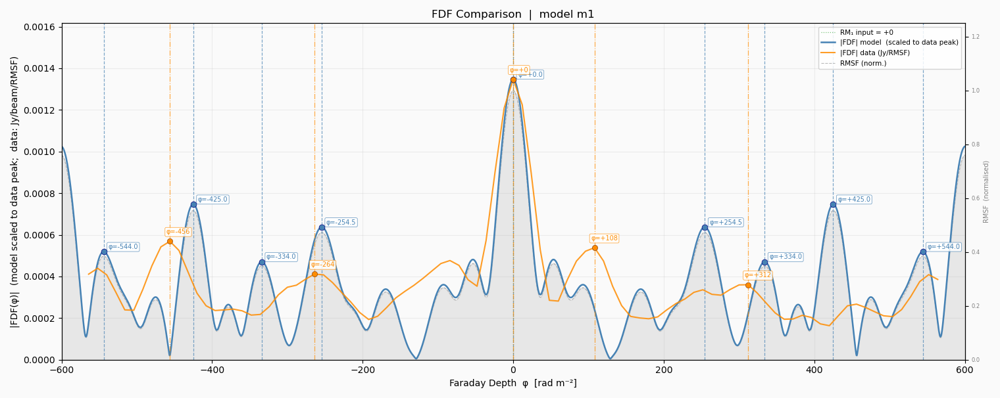
</p>

Shows up to four traces:

- **Model FDF** *(blue)* — RM synthesis of the current model parameters
- **Data FDF** *(orange)* — aperture-summed real FDF, plotted in Jy/RMSF
- **RM input lines** *(green / red / purple dotted)* — vertical lines at each
  RM parameter of the current model
- **RMSF** *(grey shaded region + dashed line)* — the instrument response in
  Faraday space, **always shown normalised to 1.0 on a secondary right-hand
  y-axis**

The right axis is fixed at 0.00 – 1.25 so the RMSF peak (= 1.0) always sits
at the same visual height. The left axis auto-scales to the model and data.

Detected peaks are marked with vertical dashed lines, a scatter point, and a
boxed label showing the Faraday depth `φ` in rad/m².

When the **Normalise** toggle is OFF, the model is plotted in its native
fractional-polarisation units (0 – 1):

<p align="center">
  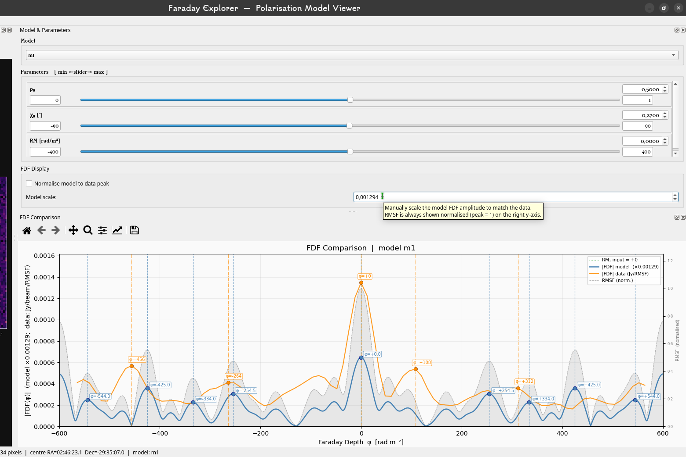
</p>

This is useful if you want to read the model amplitude in physical
polarisation-fraction units while the data is shown separately in Jy/RMSF.

---

## Beam Handling

Faraday Explorer reads beam information from two distinct FITS conventions and
takes one of four actions on launch.

### Where beam information is read from

1. **CASA per-plane BEAMS extension** *(preferred)* — a binary table extension
   (`EXTNAME='BEAMS'`) holding one row per channel with `BMAJ`, `BMIN`, `BPA`
   columns. CASA writes this whenever the restoring beam varies across
   frequency. When found, the **largest beam** (largest BMAJ — i.e. the
   coarsest channel) is used as the reference for aperture-size reporting,
   while the per-channel array is stored for downstream use.
2. **Primary-header keywords** — standard `BMAJ`, `BMIN`, `BPA` in degrees.
   Used only when no BEAMS extension is present.

### The four cases

| Case | Action |
|---|---|
| All cubes have beams that agree (within 2 % on axes, 1° on BPA) | Proceed silently |
| Some cubes have beam info, others don't | Warn, note which cube's beam will be used |
| Cubes have beams that disagree beyond tolerance | Hard-error and return to file picker — re-image with a common restoring beam |
| No cube has any beam info at all | Open the manual entry dialog |

#### CASA BEAMS table detected

<p align="center">
  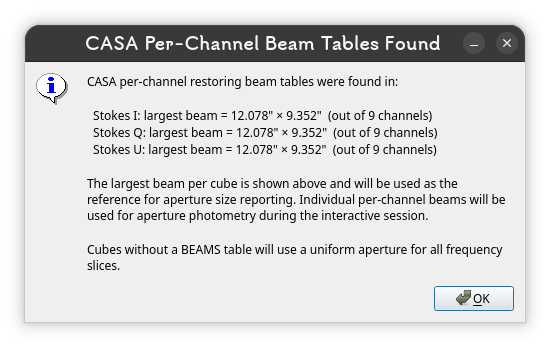
</p>

When one or more cubes carry a `BEAMS` extension, an information popup names
those cubes, reports the largest beam per cube and the channel count, and
explains that per-channel beams will be used for photometry.

#### No beam info found anywhere

<p align="center">
  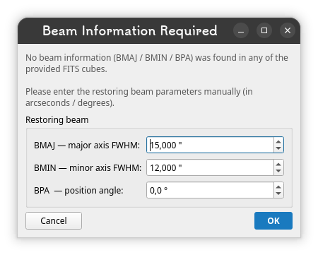
</p>

If neither convention is present in any cube, the user is asked to enter
BMAJ, BMIN, and BPA manually. The dialog uses arcseconds for the axes and
degrees for the position angle, with three-decimal precision.

#### Beam mismatch

<p align="center">
  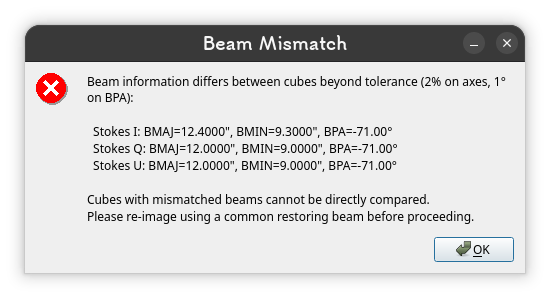
</p>

When beams differ by more than 2 % on either axis or 1 ° on BPA, a critical
error dialog lists each cube's beam to four decimal places and explains the
remedy. This tolerance mirrors CASA's `imsmooth` "are these beams the same"
criterion.

---

## File Formats

### FDF FITS cube

| Property | Value |
|---|---|
| Array shape | `(n_phi, n_dec, n_ra)` |
| Data type | `float32` typically |
| BUNIT | `Jy/beam/RMSF` |
| CTYPE3 | `FDEP` (or any axis name — Faraday depth is reconstructed from `CRVAL3`, `CDELT3`, `CRPIX3`) |

### Stokes I, Q, U FITS cubes

| Property | Value |
|---|---|
| Array shape | `(n_freq, n_dec, n_ra)` |
| Spatial dimensions | Must match the FDF cube exactly |
| Units | Jy/beam (Q and U are divided by I to form fractional polarisation) |
| BEAMS extension | Optional but strongly recommended for per-channel beams |

All three cubes (I, Q, U) must be provided together. If any one is absent or
the paths are not given, the tool runs in FDF-only mode and the q/u scatter
points are simply not drawn.

### freqFile.dat

Plain text, one frequency per line in Hz. Each line corresponds to one
spectral window (SPW) centre frequency used during imaging.

Example — nine MeerKAT L-band SPW centres (916 MHz to 1644 MHz):

```
9.16272329e+08
9.88997329e+08
1.06172233e+09
1.13444733e+09
1.27989733e+09
1.35262233e+09
1.42534733e+09
1.49807233e+09
1.64352233e+09
```

---

## Model Reference

All models follow the RM-Tools convention (Van Eck 2026). The complex
fractional polarisation `P(λ²)` is synthesised analytically and transformed to
the Faraday-depth domain via RM synthesis.

| Model | Physics | Parameters |
|---|---|---|
| **m1**  | Single Faraday-thin source.  `P = p₀ exp(2i(χ₀ + RM·λ²))` | p₀, χ₀, RM |
| **m2**  | Thin source with external dispersion screen.  `P = … exp(-2σ²λ⁴)` | p₀, χ₀, RM, σ_RM |
| **m5**  | Single Burn slab (uniform differential rotation).  Top-hat FDF; peak at RM + ΔRM/2 | p₀, χ₀, RM, ΔRM |
| **m6**  | Double Burn slab | p₁, χ₁, RM₁, ΔRM₁, p₂, χ₂, RM₂, ΔRM₂ |
| **m7**  | Internal dispersion + differential rotation | p₀, χ₀, RM, ΔRM, σ_RM |
| **m11** | Two thin sources (sum of two m1) | p₁, χ₁, RM₁, p₂, χ₂, RM₂ |
| **m3**  | Two thin sources sharing one external screen | p₁, χ₁, RM₁, p₂, χ₂, RM₂, σ_RM |
| **m4**  | Two thin sources, each with its own screen | p₁, χ₁, RM₁, σ₁, p₂, χ₂, RM₂, σ₂ |
| **m12** | Internal dispersion + differential rotation + foreground screen | p₀, χ₀, RM_scr, ΔRM, σ_int, σ_fg |
| **m111**| Three thin sources (sum of three m1) | p₁, χ₁, RM₁, p₂, χ₂, RM₂, p₃, χ₃, RM₃ |

**Parameter notation:**

- `p₀, p₁, p₂, p₃` — fractional polarisation amplitude (dimensionless, 0 – 1)
- `χ₀, χ₁, ...` — intrinsic polarisation angle (degrees)
- `RM, RM₁, RM₂, RM₃` — rotation measure (rad m⁻²); for Burn slabs this is the
  lower edge of the slab
- `ΔRM` — differential Faraday rotation across the source (rad m⁻²)
- `σ_RM` — Faraday-dispersion width (rad m⁻²)

---

## Testing

A diagnostic test suite verifies that all ten models produce FDF peaks at
their analytically-expected Faraday depths.

```bash
conda run -n faraday_explorer python3 test_models.py freqFile.dat
```

The script prints a pass/fail table and saves `model_diagnostics.png` — a
2 × 5 grid of normalised FDF plots with green dashed lines at the expected
peaks and red dotted lines at the detected peaks. A peak is considered matched
if it falls within half the RMSF FWHM of the expected location.

---

## Performance and Known Limitations

**Aperture extraction uses the downsampled cube.** Both the peak map and the
aperture summation operate on spatially-subsampled data. The aperture semi-axes
reported in the FDF panel are translated to arcseconds via the FITS
`CDELT1/2` × map_step. For pixel-perfect aperture photometry, extract spectra
from the full-resolution cube using RM-Tools or CARTA instead.

**Faraday-depth grid is fixed for the model.** The model FDF is computed on
2401 points from −600 to +600 rad m⁻². Components with `|RM| > 600` will not
be visible on the model trace. The data FDF is always plotted on its native
axis from the FITS header.

**Model and data are on different physical scales unless normalised.** When
the **Normalise** toggle is ON, the model is scaled so its peak matches the
data peak (units become Jy/RMSF for both). When OFF, the model is in
fractional polarisation (0 – 1) and the data is in Jy/RMSF — the y-axis label
makes this explicit.

**9-channel RMSF sidelobes.** With only nine SPW centres, the RMSF main-lobe
sidelobe sits at ≈ 58 % (compared to ≈ 20 % for a full 161-channel L-band
cube). A single FDF peak can produce sidelobe artefacts that look like
secondary components. Always check the RMSF response on the right-hand y-axis
before interpreting multi-peaked structures.

---

## Troubleshooting

**The desktop icon doesn't launch the app.**
Right-click the shortcut on your desktop and choose *Allow Launching* (GNOME
requires explicit trust for `.desktop` files copied into Desktop).

**`conda not found` when running the launcher.**
Edit the `find_conda()` block at the top of `launch_faraday_explorer.sh` to
point to your Anaconda/Miniconda install root, or set the `CONDA_BASE`
environment variable before running.

**The splash video is black or stutters.**
Ensure the `ffmpeg` package was installed in the conda environment
(`conda list -n faraday_explorer ffmpeg`). If absent, run
`conda env update -n faraday_explorer -f environment.yml`. The viewer falls
back to a static frame if video decoding fails.

**The Faraday axis on my FDF cube reads in wrong units.**
The tool reads `CRVAL3`, `CDELT3`, `CRPIX3` literally from the header — make
sure these are stored in rad m⁻² and that `NAXIS3` matches the actual array
length.

**Beam information differs by < 2 % but I want to be stricter.**
The tolerance lives in `validate_inputs()` in `faraday_explorer.py`
(`frac_tol=0.02, bpa_tol=1.0`). Edit and re-run.

---

## How to Cite

If you use Faraday Explorer in published work, please cite **both** the
software itself **and** RM-Tools (whose polarisation-model definitions are
implemented in this tool).

### Faraday Explorer

```
S. Amani Njoroge, "Faraday Explorer: an interactive Faraday-depth
polarisation model viewer for radio astronomy", 2026.
University of Cape Town, Department of Astronomy.
ORCID: https://orcid.org/0000-0001-9756-7350
Software: https://github.com/NJRSAM003/FaradayExplorer
```

**BibTeX:**

```bibtex
@software{Njoroge_FaradayExplorer_2026,
  author       = {Njoroge, S. Amani},
  title        = {{Faraday Explorer}: an interactive Faraday-depth
                  polarisation model viewer for radio astronomy},
  year         = {2026},
  affiliation  = {University of Cape Town, Department of Astronomy},
  orcid        = {0000-0001-9756-7350},
  url          = {https://github.com/NJRSAM003/FaradayExplorer}
}
```

A machine-readable `CITATION.cff` file is included at the repository root —
GitHub will use it to populate the *Cite this repository* button automatically.

### RM-Tools

The ten polarisation models implemented here follow the conventions defined
by the CIRADA RM-Tools package. Please also cite:

> Purcell, C. R., Van Eck, C. L., West, J., Sun, X. H., & Gaensler, B. M.
> *RM-Tools: Rotation measure (RM) synthesis and Stokes QU-fitting.*
> Astrophysics Source Code Library, record ascl:2005.003 (2020).
> https://github.com/CIRADA-Tools/RM-Tools

---

## Licence

Faraday Explorer is released under the **MIT licence**. You are free to use,
modify, and redistribute the code for any purpose (including commercial and
academic work) provided the copyright notice and licence text are retained.
See [`LICENSE`](LICENSE) for the full text.

> Copyright © 2026 S. Amani Njoroge, University of Cape Town.
